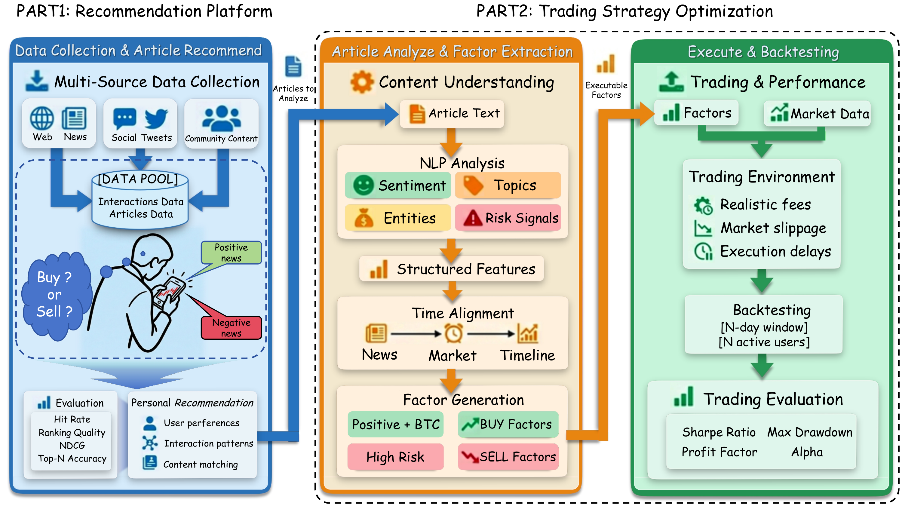

# W3Alpha


**Motivation.** Web3 news supports both information assessment ("Can I trust?") and subsequent trading decisions ("Should I buy?"). W3α complements recommendation ranking quality with downstream trading utility.

Anonymous research artifact for **W3: A News-to-Alpha Benchmark for Utility-Driven Web3 Recommendation and Trading Backtesting**, submitted to WSDM.

This repository joins the original recommendation benchmark and the News2Alpha sentiment/backtesting engine into one reproducible pipeline.

## Framework overview



**Method overview.** W3α connects personalized Web3 news recommendation with trading utility evaluation. Recommended news is temporally aligned, converted into standardized sentiment context, and evaluated through agent-based backtests under shared transaction costs and risk constraints.

> **Dataset access:** [W3-NewsAlpha on Hugging Face](https://huggingface.co/datasets/jining-luan/W3-NewsAlpha). See the dataset overview below for the paper-aligned description.

The repository currently contains source code, synthetic examples, tests, benchmark protocols, and aggregate result tables only. It contains no private dataset, identity mapping, credentials, model checkpoints, or personal author information.

## W3α dataset

The dataset is hosted at [W3-NewsAlpha on Hugging Face](https://huggingface.co/datasets/jining-luan/W3-NewsAlpha). Sign in and review the dataset's access conditions to request access.

W3α connects personalized Web3 news recommendation with downstream trading-utility evaluation. It was constructed from CoinMeta's news archive and anonymized user interaction logs collected from **January 1, 2022 to January 1, 2026**. The news covers financial reporting, exchange announcements, and project updates. Article and interaction timestamps are normalized to UTC with **millisecond-level precision** for temporal alignment.

The following statistics are reported in **Table 2 of the paper**:

| Statistic | Value |
| --- | ---: |
| News articles | 732,526 |
| Active users | 9,732 |
| Keywords | 7,050 |
| Likes | 61,102 |
| Favorites / bookmarks | 189,368 |
| Comments | 22,386 |
| Dislikes | 4,253 |

The data includes article titles, abstracts, bodies, and metadata, together with click/impression logs and separate tables for likes, favorites, comments, and dislikes. Preprocessing removes invalid or low-quality content, cleans text, excludes users with fewer than five interactions, and filters abnormal automated activity. Impression records are ordered chronologically and partitioned into **80% training, 10% validation, and 10% test** to avoid using future interactions for training.

Evaluation combines recommendation ranking with a shared trading protocol: timestamp-valid recommended news is converted into FinBERT sentiment factors and a market memo, then supplied to the trading agent under common transaction costs and risk constraints. Alongside ranking metrics such as AUC, MRR, NDCG, Recall, and Precision, the paper reports cumulative return (CR), return standard deviation (S.D.), Sharpe ratio (SR), and maximum drawdown (MDD).

This description follows **Section 3.2, Table 2, Section 3.3, and Appendix C** of the paper. **Appendix F** documents consent, salted SHA-256 user anonymization, removal of personally identifiable information, and academic-only use. The dataset must not be used for re-identification or malicious market-sentiment manipulation.

## Repository layout

```text
benchmark/                    recommendation baselines and evaluators
sentinels/                    sentiment, LLM adapters, and backtesting engine
w3alpha/                      bridge between recommendation and alpha stages
scripts/
  run_integrated_pipeline.py  W3 Top-K -> News2Alpha input/memo
  run_daily_pipeline.py       news -> sentiment factors -> memo
  run_mini_backtest.py        memo -> agent -> fills and PnL
  check_anonymity.py          repository PII/secret guard
config/                       example runtime configuration
examples/sample_data/         synthetic news and OHLCV fixtures only
tests/                        offline unit and integration tests
docs/                         data contract and reproduction notes
```

## 1. Install

Python 3.10 or newer is required. From the repository root:

```bash
python3 -m venv .venv
source .venv/bin/activate
python3 -m pip install --upgrade pip
python3 -m pip install -e ".[dev]"
```

Optional components are installed separately:

```bash
# recommendation baselines and data conversion
python3 -m pip install -e ".[benchmark]"

# FinBERT sentiment inference; the first model load may download weights
python3 -m pip install -e ".[sentiment]"

# OpenAI-compatible LLM agent
python3 -m pip install -e ".[llm]"

# every optional component plus test tools
python3 -m pip install -e ".[all,dev]"
```

Copy the example configuration only when you need to customize defaults:

```bash
cp config/config.example.yaml config/config.yaml
cp config/backtest_config.example.yaml config/backtest_config.yaml
```

Both destination files are ignored by Git. Secrets are read from environment variables; do not write real keys into tracked files.

## 2. Verify the code-only release

The following path is offline and needs neither the research dataset nor an API key:

```bash
pytest
python3 scripts/run_mini_backtest.py \
  --date 2026-01-15 \
  --agent ema_cross \
  --no-news
python3 scripts/check_anonymity.py --root .
```

The included OHLCV file is deterministic synthetic data. Its returns validate the simulator plumbing, not a trading strategy.

## 3. Run the integrated pipeline

Prepare the anonymous WebRec benchmark split from the dataset under `data/webrec_v1/` using the file contract in [docs/DATA.md](docs/DATA.md):

```text
data/webrec_v1/
  interactions.csv
  item_features.csv
  train.csv
  valid.csv
  test.csv
```

Generate leakage-free popularity recommendations from the training split and export the exact files consumed by News2Alpha:

```bash
python3 scripts/run_integrated_pipeline.py \
  --data-dir data/webrec_v1 \
  --user-id 0 \
  --date 2026-01-15 \
  --top-k 30 \
  --output-dir output/integrated \
  --skip-sentiment
```

The bridge exports only anonymous contiguous `user_idx` and `item_idx` values. It does not export source database identifiers or use validation/test labels as recommendations.

To continue through FinBERT and produce the strategy memo, install the `sentiment` extra and omit `--skip-sentiment`:

```bash
FINBERT_TRANSLATE=0 python3 scripts/run_integrated_pipeline.py \
  --data-dir data/webrec_v1 \
  --user-id 0 \
  --date 2026-01-15 \
  --top-k 30 \
  --output-dir output/integrated
```

`FINBERT_TRANSLATE=0` keeps titles local. Translation is opt-in because enabling it can send article text to the configured LLM endpoint.

Run the downstream simulator with the generated recommendation files:

```bash
python3 scripts/run_mini_backtest.py \
  --date 2026-01-15 \
  --user-id 0 \
  --articles output/integrated/articles.csv \
  --recommendations output/integrated/daily_recommendations.csv \
  --agent ema_cross
```

For the LLM agent, export credentials in the current shell and change `--agent` to `llm`:

```bash
export LLM_PROVIDER=openai
export LLM_API_KEY=YOUR_KEY
export LLM_MODEL=YOUR_MODEL
```

An OpenAI-compatible gateway may additionally require `LLM_BASE_URL`. Model decisions and prompts are written under the ignored `output/` directory.

## 4. Reproduce recommendation benchmarks

```bash
python3 benchmark/run_benchmark.py \
  --data-dir data/webrec_v1 \
  --output-dir benchmark/results

python3 benchmark/export_recbole_dataset.py \
  --data-dir data/webrec_v1 \
  --output-dir benchmark/recbole_data/webrec
```

RecBole, text-modality, and Prompt4NR tracks have additional dependencies and external model requirements. See [docs/REPRODUCIBILITY.md](docs/REPRODUCIBILITY.md) and [benchmark/README.md](benchmark/README.md). The classic full-ranking and LLM impression-ranking tracks use different candidate sets and must be reported separately.

## Data and privacy contract

- Public release identifiers are contiguous, anonymous indices. No reversible user/item mapping is published.
- Raw database exports, local data, prompts, model replies, logs, caches, and checkpoints are excluded from Git.
- Do not attempt to re-identify users or join anonymous identifiers to external identity sources.
- Run `python3 scripts/check_anonymity.py --root .` before every public update.

More details are in [docs/DATA.md](docs/DATA.md).

## Reproducibility notes

- Recommendation models are fit on `train.csv`; evaluation labels are not used to create bridge recommendations.
- Synthetic market data is generated from a fixed seed.
- Trading decisions can be cached and replayed, but a fresh `run_id` should be used whenever the model, memo, risk configuration, or input data changes.
- Real API keys and local configuration must remain outside Git.

## Licenses

The W3Alpha benchmark is distributed under the terms in [LICENSE](LICENSE). The incorporated News2Alpha engine retains its MIT notice in [LICENSES/NEWS2ALPHA-MIT.txt](LICENSES/NEWS2ALPHA-MIT.txt).
